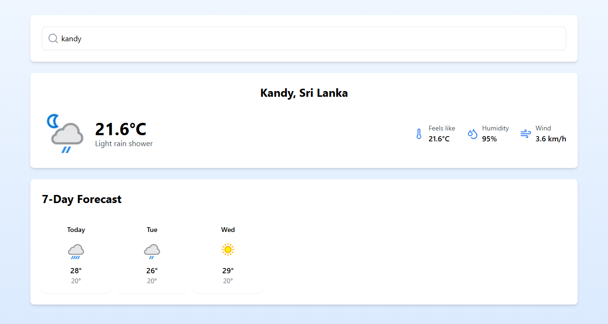

# ☁ Weather Application

A contemporary weather application built with React that delivers current weather updates and 7-day forecasts for any location. This application leverages Tailwind CSS for styling and is powered by WeatherAPI.

## Features

- 🔍 Real-time search functionality with debouncing
- 🌡️ Display of current weather conditions
- 📅 Detailed 7-day weather forecasts
- 📱 Fully responsive design for various devices
- ⚡ Quick and efficient API requests
- 🎨 Sleek and modern user interface using Tailwind CSS
- ⚠️ Comprehensive error handling and loading indicators

## Project Link
[Weather Application Live Demo](https://lahiruanushka.github.io/react-weather-app/)

## Screenshots

